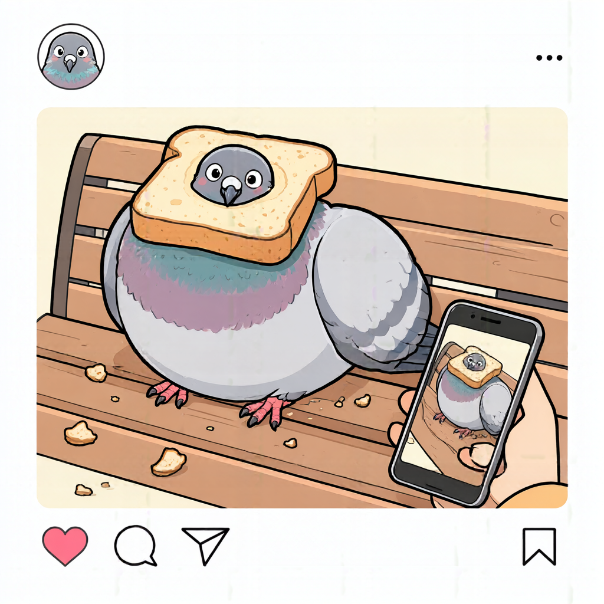
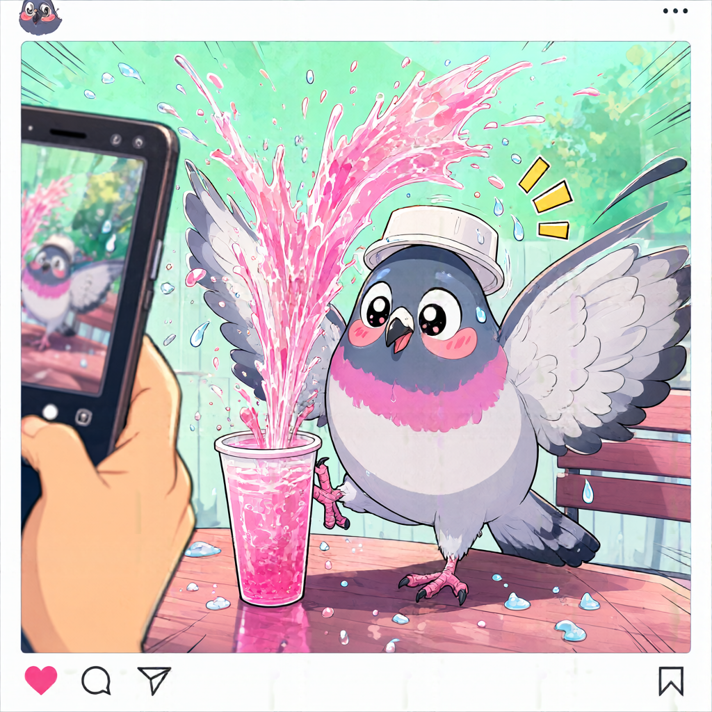
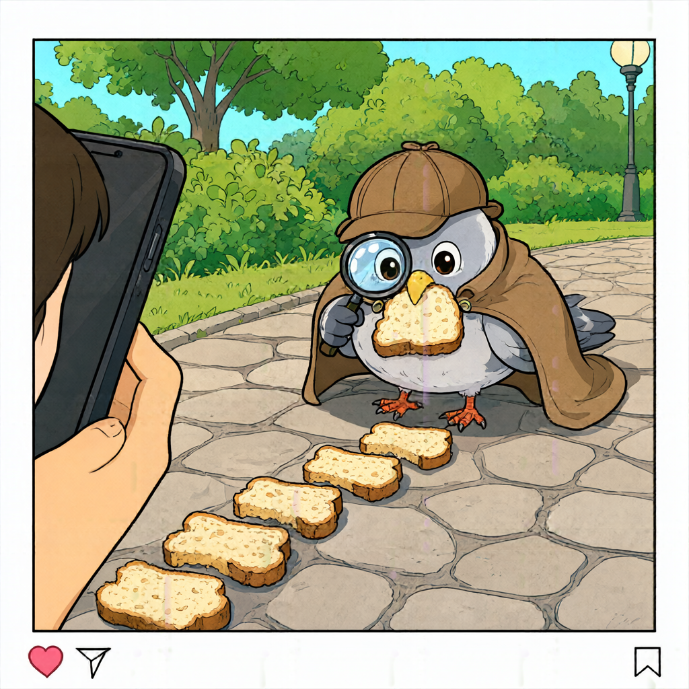

> v0.1.3：幅・高さの⇄交換、生成回数1–99×同時枚数1–10、5プリセット、Euler標準/Karras/Exponentialに対応。CFG 1でも通常の指示は有効です。更新後はRun.batで再起動してください。

# cvELD Image Studio
## 日本語マニュアル · Windows 11 / RTX 5090向け · v0.2.0

作成日：2026年9月21日。対象モデル：**Qwen-Image-2.1**。これはQwen公式製品ではなく、公式モデルとDiffusersを利用する独立したローカルWebUIです。

> **最初にお読みください**
> 実モデルによる生成例を掲載しています。鳩の3種類のサンプル画像と設定を本書に掲載しています。掲載例は1024×1024・40ステップ・CFG 1・同時1枚の結果です。他のGPUや設定での速度・メモリ使用量を保証するものではありません。
>
> **モデルの利用条件**
> 公開モデルにはQwen Research License Agreementが適用されます。一般的な商用利用自由のライセンスではありません。研究・評価用途に限定され、商用利用には別途許諾が必要です。衣装・素材の販売、業務向け画像制作などにそのまま利用できるとは判断しないでください。実際の契約原文が優先します。[公式ライセンス](https://github.com/QwenLM/Qwen-Image-2.1/blob/main/LICENSE)

## 1. 最初の起動

1. ZIPを**すべて展開**します。推奨例は `D:\AI\cvELD_Image_Studio` です。ZIP内から直接起動しないでください。
2. 展開先の `Run.bat` をダブルクリックします。
3. 初回だけ表示される利用条件を確認し、同意して続行する場合は y、中止する場合は n と入力します。同意済みなら次回から確認は表示されません。
4. Python、CUDA対応PyTorch、必要なライブラリ、モデルが順に取得され、ブラウザーが開きます。
5. 「生成」で512×512を選択し、たとえば「白い背景の上に置かれた青いマグカップ、柔らかい自然光」と入力して生成します。まず1枚、40ステップ、CFG 1で確認してください。


**自動化の対象**はアプリ専用環境の構築とモデル取得です。NVIDIAドライバーの導入・更新、Windowsの再起動、組織のネットワーク制限、権限確認、契約への同意は自動化しません。VC++ランタイムが不足する場合はMicrosoftの署名付き公式インストーラーを起動します。このときWindowsの管理者確認が出ることがあります。

初回はネットワーク接続が必要です。2回目以降は専用環境と取得済みモデルを再利用します。すべて揃っている通常起動ではモデルの再取得は不要です。ブラウザーだけを閉じてもサーバーは動き続けます。終了はRun.batのコンソールで **Ctrl+C**、またはそのコンソールを閉じます。

## 2. 用意するPCと空き容量

| 項目 | このパッケージの想定 |
|---|---|
| OS | Windows 11、Intel / AMDのx64環境。Windows ARMは対象外 |
| GPU | RTX 5090を1枚。GPU番号は初期値0 |
| ドライバー | RTX 5090と同梱PyTorch CUDAランタイムに対応するNVIDIAドライバー |
| RAM | **64 GB以上を計画上の推奨値**とします。実測した必須最小値ではありません |
| SSD | **初回は80～100 GB以上の空き容量を計画上推奨**。モデル、Python環境、ダウンロードキャッシュ、生成画像の余裕を含みます |
| モデル | 公式Hugging Faceリポジトリの公開容量は約33.1 GB。取得対象はモデル・設定・ライセンス等です |
| 追加で事前インストールするもの | 原則Python、Git、CUDA Toolkit、Visual Studio Build Toolsは不要。専用Pythonと対応バイナリを取得します |

公式の「7B」は画像生成Transformer部分の規模で、別途8Bの画像・文章エンコーダーとVAEがあります。すべてを同時にGPU常駐させる設定にはしていません。大きな参照画像、参照10枚、2K出力、長い文章、他のGPUアプリとの同時利用では、5090でもメモリ不足になる可能性があります。

モデルの公表内容は[公式リポジトリ](https://github.com/QwenLM/Qwen-Image-2.1)、容量は[公式モデルファイル一覧](https://huggingface.co/Qwen/Qwen-Image-2.1/tree/main)に基づきます。RAMとSSDの値はこのWebUIの運用計画上の目安であり、公式の動作保証ではありません。

## 3. Run.batが行うこと

| 段階 | 処理 |
|---|---|
| 利用条件 | 固定モデル版のLICENSEを取得して表示し、明示的な同意を記録 |
| セットアップ補助 | uv 0.12.17の公式Windows ZIPを取得し、固定SHA-256で照合してから実行 |
| ランタイム | VC++ x64ランタイムの有無を確認。不足時はMicrosoft署名を確認した公式インストーラーを起動 |
| Python | アプリ内にuv管理のPython 3.12と `.venv` を作成 |
| GPUライブラリ | PyTorch 2.11.0 / torchvision 0.26.0のCUDA 12.8版を公式配布先から取得 |
| 推論ライブラリ | Transformers 5.17.0と、QwenImage21Pipeline対応のDiffusers固定コミットを導入 |
| 動作診断 | クラスのimport確認に加え、選択GPU上でBF16の行列積とSDPAを実際に計算。失敗時は大容量モデル取得前に停止 |
| モデル | 固定リビジョンの必要なsafetensors・設定を取得。公式メタデータとサイズ・ハッシュを照合 |
| WebUI | `127.0.0.1` の空きポートにローカルサーバーを起動し、ブラウザーを開く |

PyTorchのバージョン・CUDA配布方法は[公式インストール資料](https://pytorch.org/get-started/previous-versions/)を参照しています。CUDA Toolkitを別途インストールしても、CPU版PyTorchをGPU版へ変換することはできません。このパッケージは最初からCUDA版を指定します。

補助ライブラリは初回に指定範囲内で解決し、実際に解決した一覧を `.runtime/requirements.resolved.txt` に記録します。初回から全推移的依存を完全固定した、Windows上で検証済みのロックファイルではありません。Repairはこの実際の解決結果を利用して再構築します。コアライブラリとモデルの固定値は「12. 開発・検証」を参照してください。

ダウンロード失敗時は、理由を確認してRun.batを再実行します。成功済みの環境や完成ファイルを使い、Hugging Faceクライアントの途中キャッシュを利用して再試行します。破損した完成ファイルは、モデル用フォルダー内の対象ファイルだけを削除して再取得します。中断した全通信が必ずバイト単位で再開できるという保証ではありません。

## 4. 画面の使い方

左側が設定、右側がプレビュー・履歴・マスク編集です。日本語・英語のプロンプトを入力できます。文章を自動翻訳する外部APIや、別モデルによるプロンプト自動書き換えは使いません。

### テキストから生成

「生成」タブでプロンプトを入力し、出力サイズを選び、枚数・ステップ・CFGをスライダーまたは数値入力で調整します。右上または左側の生成ボタンを使います。「画像を生成する」、または **Ctrl+Enter** でキューに追加します。初回のモデル読み込み中は、ステップがまだ進まない時間があります。

「生成回数」×「同時枚数」が合計出力数です。同時枚数を増やすと必要なVRAMも増えます。固定SeedをSにすると、各画像はS、S+1、S+2…となります。32ビットの上限を越えると0へ戻ります。Seed -1ではジョブごとにランダムな開始Seedを決定し、実際のSeedを結果に記録します。

### 画像を編集

「編集」に切り替え、参照画像をドラッグ＆ドロップ、または追加領域をクリックします。通常の画像編集は最大10枚です。各画像の矢印で順番を変えられます。生成結果の「編集に送る」で、その画像を新しい参照画像1として利用できます。

画像番号に言及するプロンプト例：

```
画像1の衣装の形状、パーツ配置、縫い目、素材感をできるだけ維持してください。
主要な布の色だけを深いネイビーに変更してください。
新しいパーツや装飾は追加しないでください。
```

AI編集は通常、参照画像の全ピクセルを保証して保持する処理ではありません。変更したくない範囲の厳密な保持には、次の「部分編集」を利用します。

対応入力は静止画のPNG・JPEG・WebP・BMP、1枚32 MiB以下、3200万画素以下です。アニメーションやSVGには対応しません。入力は向きを補正したPNGコピーとして保存し、EXIF等の元メタデータを引き継ぎません。元ファイルそのものは上書きしません。

### 部分編集

「部分編集」を選び、参照画像1を追加します。右側のマスクキャンバスで**変更したい場所だけを白く塗ります**。消しゴムで除外し、「クリア」で描き直せます。追加の参考画像は最大8枚、元画像を含めて9枚です。10番目の枠はアプリが白黒マスク用に使用します。

この機能は、公開パイプラインに専用の `mask_image` を渡すネイティブなインペイントではありません。**元画像と領域ガイドを参照画像としてAIへ渡し、必要に応じて生成結果を元画像と合成する方式**です。マスク内で指示どおりの変更が起きるかはモデルの能力に依存します。

「マスク外を元画像のまま保持」をONにすると、AIの未合成結果も別PNGで保存し、最終結果を元画像のピクセル寸法で合成します。フェザー0では、マスクが完全な黒のピクセルは、向き補正済み・RGBA化済みの入力PNGとRGBA値が一致します。JPEG元データの圧縮バイトや元のEXIFまで保持する意味ではありません。

フェザーを増やすと境界がぼけ、その周辺の元画像も混ざります。厳密に保持する場合は0にしてください。ブラシの輪郭には半透明のアンチエイリアスがあるため、完全な黒ではない境界ピクセルは混合されます。元画像の縦横比と生成サイズが異なる場合、生成結果を元画像寸法へリサイズして合成するため、同じ縦横比の出力設定を推奨します。

### 透過PNG

「透過背景を指示」をONにすると、アルファを持つRGBA画像を求める説明をプロンプトに追加します。これは背景除去AIを後段で実行する処理ではありません。必ず透明になるとは限りません。プレビューの市松模様と「透過あり」の表示で、実際のアルファを確認します。市松模様が画像そのものに描かれてしまった場合は、透過生成に失敗しています。

部分編集でマスク外保持をONにしている場合、外側のアルファも元画像の値を保持します。外側が不透明な元画像に対して、透過指定だけで外側全体を透明にすることはしません。

## 5. 解像度とRTX 5090向け設定

| 設定 | 初期値 / 動作 |
|---|---|
| 推論精度 | BF16。モデル重みの量子化なし |
| 基本プロファイル | バランス：モデル単位のCPUオフロード |
| 省VRAM | より細かいCPUオフロード。転送が増え、遅くなる可能性あり |
| Attention | 公式QwenImage21AttnProcessorによるexact segmented SDPA |
| VAE | タイル処理を有効化 |
| KVキャッシュ | 公式パイプラインのキャッシュを有効化 |
| テキストキャッシュ | テキスト生成のみ。CPU RAM上の上限96 MiBのLRUキャッシュ |
| 画像編集の初期サイズ | 768×768。参照画像の処理解像度も768 |
| テキスト生成の初期サイズ | 1024×1024。ただし初回の実機確認は512×512で実施 |
| CFG | 1。1を超える場合だけネガティブプロンプトを使用 |
| ステップ | 40。減らすと処理量は減るが、品質への影響は要確認 |

**出力の幅・高さ**と**参照画像の処理解像度**は別の設定です。参照解像度は、入力画像をどの程度の面積で処理するかを制御するパイプラインの `output_resolution` に渡します。出力幅・高さは別途明示的に指定しています。参照解像度を512へ下げても、保存する出力幅を勝手に512へ変更しません。

出力は幅・高さとも32の倍数、256～4096の範囲、合計460万画素以下です。2Kのプリセットもありますが、これはモデルの出力設定に対応したものであって、5090で任意の参照枚数と組み合わせて成功する保証ではありません。

メモリ不足時は、他のGPUアプリを終了し、参照画像を1枚にして、参照解像度512・出力768または512・CFG 1を試してください。その後必要に応じて省VRAMを選びます。**エラー時に解像度を黙って変更する処理はありません。**

キャッシュの注意：同じ文章のT2Iでエンコード結果を再利用します。画像編集の文章は参照画像と一緒に処理するため、誤ったキャッシュを流用しません。ジョブ停止、エラー復旧、モデル解放、プロファイル変更でキャッシュは消えます。複数枚生成のSeedが変わっても、同じ文章のキャッシュは利用可能です。

Triton、別途ビルドするFlashAttention、未コンパイルのFlexAttention、torch.compile、FP8/NVFP4はこの版では使用しません。Windowsでのビルド依存を増やさず、まず公式実装の正しさとメモリの管理を優先した構成です。最速性を実測比較したわけではありません。[公式Attention実装](https://github.com/huggingface/diffusers/blob/6256aa7666cedd47443adc8f82da9a10e110b09c/src/diffusers/models/transformers/transformer_qwenimage21.py)

## 6. 保存・履歴・再利用

結果は `data/outputs` にPNGと同名のJSONで保存します。部分編集の未合成画像は `_generated.png` です。JSONには実際のSeed、プロンプト、設定、参照画像のIDとSHA-256、固定モデル版、推論時間、PyTorchが計測したGPUメモリ使用量などが入ります。PNGにも同じ趣旨の情報をiTXtメタデータとして保存します。

画面のpeak値は、PyTorchが追跡する**その処理の最大allocated量**です。OS全体のVRAM使用量やreserved量とは一致しません。画面の秒数はモデル初回ロードを除く推論処理の測定値で、予約待ち時間や初回環境構築時間ではありません。

「設定を再利用」は、元の要求Seedが-1だった場合でも、**結果の実際のSeed**を復元します。同じ設定でもGPU、ライブラリ、モデル版、数値演算経路が違うと、完全に同じピクセルになる保証はありません。

設定JSONの読み込み・書き出しにも対応しています。参照画像をJSONへ埋め込む機能ではありません。別PCにJSONだけを移しても元のアップロードIDは復元できないため、画像を再追加してください。生成前の「設定を書き出す」には未保存のキャンバスマスクを含めません。生成済み結果のJSONには保存済みマスクのIDが入ります。

履歴は新しいものから最大80件を表示します。画像ファイルは自動削除しません。画面上の直近サムネイルは最大16件、表示キューは直近8件、実行待ちジョブは最大20件です。処理はGPU用の単一ワーカーで直列に実行し、ジョブを同時にGPUへ投入しません。

**プライバシー：** プロンプトや設定はPNG・JSONに含まれるため、生成PNGを他人へ渡す際に注意してください。参照画像も `data/uploads` にコピーとして残ります。WebUIの推論では画像を外部APIに送信しません。セットアップ時は公式配布先への通信が発生します。出力は作業途中の `.partial` を経由して置換保存し、保存途中のPNGを完成画像として表示しにくくしています。

## 7. 停止・モデル解放

キューの「停止」は協調的な停止です。待機中ジョブはその場で取り消します。実行中ジョブはステップ間などのPythonへ制御が戻る区切りで停止します。モデルのロード、文章・画像エンコード、実行中のCUDAカーネルは即時中断できません。停止を押してすぐGPU使用量が0になるとは限りません。

保存済みの画像は停止しても残ります。停止・エラー後はモデルとキャッシュを解放してから次のジョブを実行します。通常完了後は次回生成のためにモデルを保持します。左側最下部の「GPUモデルを解放」は実行中・待機中ジョブがないときに使えます。

サーバー終了で待機キューは失われます。再開可能な永続キューではありません。PNGと履歴JSONは残ります。ブラウザーを再読み込みしても、サーバーが起動中なら実行中ジョブは継続します。

## 8. 診断・修復用バッチ

いずれも先にRun.batのコンソールを閉じてください。同じフォルダーからの二重起動をロックで防ぎます。

| ファイル | 役割 |
|---|---|
| `Run.bat` | 初回セットアップ・モデル取得・通常起動 |
| `Diagnose.bat` | 環境を確認し、import / CUDAカーネルの診断レポートを作成。大容量モデルは取得しない |
| `Repair.bat` | 専用 `.venv` のみ再構築。モデル・アップロード・生成画像を残して修復後に起動 |
| `VerifyModels.bat` | 取得済みモデルを全ファイルハッシュで検証し、欠落・破損を再取得。UIは起動しない |

既存の不完全な環境でDiagnoseを使った場合、必要な環境パッケージの導入が先に実行されます。完全に何もダウンロードしない診断ボタンという意味ではありません。VerifyModelsは保存済みの公式マニフェストがあればそれを使用し、なければオンラインで取得します。全モデルのハッシュ検査では大きなSSD読み出しが発生します。

レポート保存先は `logs/studio.log`、`logs/setup-日時.log`、`.runtime/hardware.json`、`.runtime/requirements.resolved.txt` です。問い合わせ時はエラー文とこれらの情報が役立ちます。共有前にユーザー名、ローカルパス、ネットワーク設定等を確認してください。

## 9. よくある問題

### CUDA unavailable / no kernel image / GPUを認識しない

NVIDIAドライバーを確認して再起動し、Diagnose.batを実行します。別アプリやシステムPythonに入れたPyTorchではなく、このフォルダーの `.venv` が使われます。意図せずCPU版へ入れ替えた場合はRepair.batを使用します。自動診断はGPU名の文字列だけで判断せず、実際のBF16計算を行います。

### WinError 126 / DLLを読み込めない

Microsoft VC++ランタイムのインストールと再起動の要否を確認してください。組織のセキュリティ製品により実行が制限されている場合、保護機能を無効にせず管理者へ確認します。既に古いVC++が導入されていると「存在する」と判定されるため、必要に応じて[Microsoft公式配布](https://learn.microsoft.com/en-us/cpp/windows/latest-supported-vc-redist?view=msvc-170)で更新します。

### モデル取得の401 / 403、ネットワークエラー

公式リポジトリへ到達できるか、利用条件・アカウント承認・プロキシ設定を確認します。将来、公開条件が変わった場合にアクセス制限を迂回する仕組みはありません。認証が必要になった場合はHugging Faceの正規の権限を持つアカウントを利用し、必要なら環境変数 `HF_TOKEN` を使います。トークンをプロンプトや共有JSONへ書かないでください。Run.batを再実行すると完成済みファイルを再利用します。

### 画面が開かない

コンソールのURLを確認します。初期値は `http://127.0.0.1:7860` で、使用中なら後続19ポートから空きを選びます。ブラウザーの自動起動が拒否された場合は、そのコンソールに表示されたURLを手動で開きます。これはPC上のローカル画面であり、iPhoneから同じURLを開いてもPCの画面には接続できません。

### 編集が弱い、輪郭が変、1024で崩れる

初期公開実装には、Apple MPS環境で編集時の参照処理解像度1024に関する不具合報告があります。Windows / CUDAで同じ現象が出ると確認されたものではありません。この版は保守的に編集の初期設定を768にしています。症状が出たら参照処理解像度512または768で比較してください。[上流の報告](https://github.com/huggingface/diffusers/issues/14824)

### ファイル名が長い、同期フォルダーで動作が不安定

アプリ全体を短いローカルSSDパスへ展開してください。クラウド同期対象のフォルダやネットワーク共有は初期構築先として推奨しません。既にセットアップしたフォルダーを移動した場合、仮想環境内のパスが古いままになる場合があります。新しい場所でRepair.batを実行します。

### 残り容量が少ない

アプリ終了後に不要な生成画像・そのJSON・アップロードコピーを整理します。`models` を削除すると再取得が必要です。`.runtime` 全体には専用Python・同意・解決済み環境情報も入っているため、容量確保目的で無差別に削除しないでください。ダウンロード中のキャッシュは削除しないでください。

## 10. 構成と設定ファイル

```
cvELD_Image_Studio/
  Run.bat / Repair.bat / Diagnose.bat / VerifyModels.bat
  config.json
  requirements.in / constraints.txt
  scripts/Bootstrap.ps1
  studio/                 Python API・推論・保存処理
  web/                    日本語WebUI
  docs/                   マニュアル・出典・検証記録
  tests/                  CPUテストとブラウザー検証用コード
  .runtime/               自動作成：Python、uv、設定情報
  .venv/                  自動作成：アプリ専用パッケージ
  models/Qwen-Image-2.1/   自動取得：公式モデル
  data/uploads/           自動作成：入力のPNGコピー
  data/outputs/           自動作成：出力PNG・JSON
  logs/                   自動作成：セットアップ・実行ログ
```

`config.json` の初期値：

```json
{
  "model_dir": "models/Qwen-Image-2.1",
  "data_dir": "data",
  "port": 7860,
  "gpu_index": 0,
  "open_browser": true,
  "text_cache_mb": 96
}
```

モデル・データのパスは相対パスまたは絶対パスにできます。Windows絶対パスをJSONへ書く場合は `"D:/AIModels/Qwen-Image-2.1"` のようなスラッシュ表記が簡単です。設定変更後は再起動してください。複数GPUへのモデル分散は実装していません。`gpu_index` は利用する1枚を選ぶ設定です。

サーバーは127.0.0.1にのみバインドします。外部公開、LAN共有、クラウドトンネルは実装していません。更新系APIにはセッショントークン・Origin検証を使い、外部サイトからの操作を抑止します。ただし同じWindowsアカウント内の悪意あるプログラムや管理者からデータを隔離するセキュリティ境界ではありません。

## 11. この版の対象外

LoRA学習・管理、ControlNet、ComfyUIワークフロー読み込み、旧Qwen-Image / Qwen-Image-Editとの自動切り替え、動画生成、自動背景除去モデル、FP8/NVFP4量子化、マルチGPU、永続ジョブ再開、遠隔公開には対応しません。

対象は**Qwen-Image-2.1の公式モデルを、対応した公開パイプラインから操作するWebUI**です。マスク機能は参照ガイドと合成、透過指定はプロンプト補助です。公式APIにない機能を、モデル本来の機能として表示しない設計です。

## 12. 開発・検証と固定バージョン

| コンポーネント | 固定値 |
|---|---|
| モデルID | `Qwen/Qwen-Image-2.1` |
| モデルrevision | `790c92633540aa0cb11d9abf19eb46d861714758` |
| Diffusers commit | `6256aa7666cedd47443adc8f82da9a10e110b09c` |
| uv | `0.12.17` |
| uv Windows ZIP SHA-256 | `a252121d5b59398fcb137c6ea448176459a44010f33f67e0072305a637119ca7` |
| Python | uv管理の3.12系列。パッチ版は取得時の管理カタログに従う |
| PyTorch / torchvision | `2.11.0+cu128` / `0.26.0+cu128` |
| Transformers | `5.17.0` |

確認したAPIは `QwenImage21Pipeline`、`image`、`true_cfg_scale`、`output_resolution`、`use_kv_cache`、`callback_on_step_end`、テキスト生成の `prompt_embeds` / `prompt_embeds_mask` です。公式Diffusersソースの固定コミットを参照しています。モデルを勝手に最新mainへ追従させないため、改善が出ても自動的には更新されません。

実施した検証と未実施項目の具体的な記録は、同梱の `RELEASE_NOTES.md` を参照してください。CPUテストのFakeEngineは `tests/` にしか存在せず、Run.batや本番起動から選択する機能はありません。テスト画像を本物のAI生成成功として表示しません。

開発環境でテストするには、アプリ環境へ `requirements-dev.txt` のテスト用パッケージを追加し、プロジェクトルートで `python -m pytest -q` を実行します。ブラウザー検証にはPlaywrightと対応するChromiumが別途必要です。テスト用依存は通常のRun.batでは導入しません。

このWebUIの独自コードは同梱LICENSEに従います。それとは別に、モデル、Diffusers、PyTorch、Transformers、uv等にはそれぞれの利用条件があります。モデル重みや第三者バイナリは配布ZIPに同梱せず、初回起動時に公式配布先から取得します。出典一覧は `SOURCES.md`、ライセンスの区別は `THIRD_PARTY_NOTICES.md` にまとめています。

GPUプリセットと出力先の詳細: [更新内容](RELEASE_NOTES.md)


## 鳩のプリセット：実生成サンプル / Pigeon preset gallery

「プロンプトの例を選ぶ」から鳩のサンプルを選び、「画像を生成する」を押します。選択時に生成モード・40ステップ・CFG 1・Euler・「透過背景を指示」OFFを適用します。サイズ、Seed、生成回数、同時枚数は現在の値を保持します。以下と比較するときは1024×1024、Seed 37392343、生成回数1、同時枚数1に設定してください。

Choose a pigeon sample from the prompt examples, then Generate. The preset selects text-to-image, 40 steps, CFG 1, Euler and transparency prompting off. Size, seed and counts stay unchanged. These examples use 1024 × 1024, seed 37392343 and one image.

実モデル Qwen-Image-2.1 によるサンプルです。画像は生成結果をそのまま掲載しています。Seedを固定しても環境が変われば完全一致しない場合があります。

### 食パンにはまる / Toast mishap



食パンにはまった顔、ベンチ、撮影するスマートフォン、SNS風の枠を確認できました。両翼は広がらず、慌てる動きは控えめです。 / The toast, bench, phone and social-post frame are present; the wings remain folded.


**使用したプロンプト / Prompt**

可愛いポップな漫画イラスト。公園のベンチの上で、丸く太った鳩の首に四角い食パンが一枚すっぽりはまっている。食パンの中央の穴から鳩の顔が出ており、鳩は目を丸くして頬を赤らめ、両翼を横へ広げて慌てている。足元にはパンくず。右手前にはスマートフォンで鳩を撮影する人の手があり、スマホ画面にも食パンにはまった鳩が映る。全体は白いSNS投稿カードの中のイラストで、下部にハートと吹き出しのアイコン。太い輪郭線、黄色と水色とピンク、シンプルで読みやすい構図。

### ソーダ大噴射 / Soda surprise



ピンクの噴射、大きく広げた翼、驚いた表情、撮影するスマートフォンを確認できました。足はコップの側面付近にあり、「踏みつぶす」動作は明確ではありません。 / The soda spray, open wings and phone are present; stepping on the cup is not clearly depicted.


**使用したプロンプト / Prompt**

可愛いポップな漫画イラスト。屋外カフェのテーブルで、丸くデフォルメされた鳩がソーダの紙コップを片足で踏み、ピンク色のソーダが噴水のように真上へ噴き出した瞬間。鳩はのけぞり、両翼を大きく広げ、頭には外れたコップの蓋が帽子のように載っている。大きく見開いた目、赤い頬、周囲に水滴と驚きの線。画面の左手前に、この失敗を撮影するスマートフォンと人の手。白いSNS投稿カードの枠と、下部にハートとコメントのアイコン。明るいミントグリーンとピンク、太い輪郭、躍動感のある一コマ。

### 犯人は自分 / Clumsy detective



探偵帽、ケープ、虫眼鏡、くわえたパン、足元へ続くパンの列を確認できました。パンくずは大きなパン片となり、スマートフォンは指定した右側ではなく左側に描かれました。 / Detective accessories and the bread trail are present; crumbs became large pieces and the phone appears on the left instead of the requested right.


**使用したプロンプト / Prompt**

可愛いポップな漫画イラスト。小さな探偵帽と茶色いケープを着た丸い鳩が、虫眼鏡を持ち、公園の石畳に落ちたパンくずの列を真剣に調べている。パンくずの列は鳩自身の足元まで続き、鳩のくちばしには大きなパンのかけらがくっついている。犯人が自分だと気づいていない得意げな表情。右手前に、鳩の間抜けな姿をスマートフォンで撮影する人の手。鳩の全身、虫眼鏡、パンくずの道が一枚で分かる少し引いた構図。全体をSNS投稿カードで囲み、下部にハートと吹き出しのアイコン。太い輪郭線、鮮やかな黄色とターコイズ、ユーモラスな絵本風。


# 利用責任とサポート方針 / Usage and support policy

## 日本語

本ツール独自コードの利用条件は同梱のMIT LICENSEに従います。モデル、ライブラリ、入力素材および生成物には、それぞれ別の利用条件や第三者の権利が関係する場合があります。

モデルおよび依存ソフトウェアのライセンス確認・遵守、必要な許諾の取得、入力素材と生成物の利用・公開・販売の判断は、利用者ご自身の責任で行ってください。本ツールの提供は、モデルの商用利用許諾や第三者の権利を付与するものではありません。Qwen-Image-2.1は研究・評価向けのライセンスであり、商用利用にはQwenからの別途許諾が必要です。必ず取得するモデル版の原文を確認してください。

操作上の質問や再現可能な不具合報告には、提供者が可能な範囲でサポートします。ただし、回答・修正・更新・個別環境への対応、期限内の解決を保証するものではありません。

生成結果への不満、期待した品質・速度・用途を満たさないこと、利用者のライセンス違反や第三者との紛争などに関するクレーム対応、個別補償、紛争解決の代行は行いません。本ツールおよび生成結果は現状のまま提供し、成果・収益・権利非侵害・特定環境での動作を保証しません。損害等については、適用法令で認められる範囲で責任を負いません。法令上排除・制限できない責任や利用者の権利を排除するものではありません。

本方針は、MIT LICENSEまたは第三者ライセンスで認められた権利・定められた義務を変更するものではありません。

## English

The original tool code is provided under the included MIT LICENSE. Models, libraries, input materials and outputs may be subject to separate terms and third-party rights.

Users are responsible for reviewing and complying with all applicable licenses, obtaining permissions, and deciding whether to use, publish or sell inputs and outputs. Providing this tool does not grant commercial model permission or third-party rights. Qwen-Image-2.1 has a research/evaluation license; commercial use requires separate permission from Qwen. Review the license of the model revision you obtain.

The provider may offer limited, best-effort assistance with usage questions and reproducible bug reports. Responses, fixes, updates, compatibility with individual systems and resolution deadlines are not guaranteed.

The provider does not undertake complaint handling, individual compensation or dispute representation relating to dissatisfaction with outputs, unmet expectations of quality, speed or suitability, user license violations, or third-party disputes. The tool and its outputs are provided as is without guarantees of results, profit, non-infringement or compatibility. Liability is excluded to the extent permitted by applicable law; non-excludable liabilities and statutory rights remain unaffected.

This policy does not amend rights or obligations under the MIT LICENSE or third-party licenses.

Official model terms: https://github.com/QwenLM/Qwen-Image-2.1/blob/main/LICENSE

